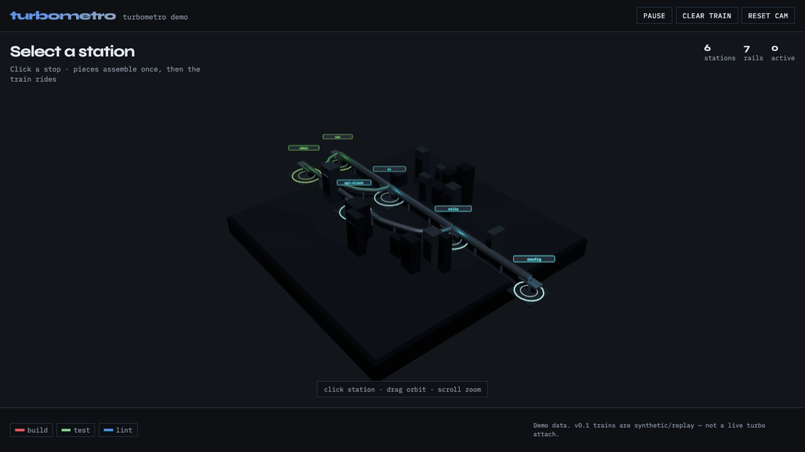

# turbometro

**Your monorepo as a subway — trains run when turbo does.**

`npx turbometro` turns a **pnpm** monorepo into a self-contained **3D subway**: packages are stations, workspace deps are rails, and tasks ride as trains. Works with or without `turbo.json`.



> **v0.1 honesty:** trains are **synthetic / replay** by default (not a live turbo attach). Live attach is on the roadmap.

## Quick start

```bash
# inside any pnpm workspace (apps/** globs OK; turbo.json optional)
npx turbometro@0.1.1
# writes ./metro.html — serve over http (CDN Three.js)
npx --yes serve . -p 4173
# open http://localhost:4173/metro.html
```

## Demo (this repo)

```bash
npm install
npm run build
node bin/turbometro.js --demo --out metro.html
npx --yes serve . -p 4173
```

Against the fixture:

```bash
node bin/turbometro.js --cwd fixtures/mini-mono --out metro.html
```

## CLI

```
turbometro [--out metro.html] [--replay run.json] [--force] [--cwd dir]
turbometro --demo
```

| Flag | Meaning |
|------|---------|
| `--demo` | Built-in sample graph (no workspace required) |
| `--replay` | Use a timeline JSON instead of synthetic events |
| `--force` | Bypass the 150-package hard cap |
| `--out` | Output path (default `./metro.html`) |

## Interaction

- **First click** on a station: stop kit assembles piece-by-piece, then the train materializes and rides the dep path
- **Later clicks**: train keeps the mesh — only the path retargets (no flicker)
- Orbit: drag · zoom: scroll · **Clear train** removes the rider

## Requirements

- Node ≥ 20
- Target repo: `pnpm-workspace.yaml` (supports `*` and `**` package globs)
- `turbo.json` / `turbo.jsonc` optional — without it, task legend is inferred from package scripts
- Dependency cycles: **warned** and cycle edges dropped (map still renders)
- Open the HTML via a local static server (`file://` can block ES modules / CDN)

## Replay JSON

```json
{
  "events": [
    { "t": 0, "task": "build", "package": "@mini/web", "status": "running" },
    { "t": 800, "task": "build", "package": "@mini/web", "status": "pass" }
  ]
}
```

## Credits

Metro layout engine vendored from [23min/DAG-map](https://github.com/23min/DAG-map) (Apache-2.0). See `vendor/dag-map/NOTICE`.

## License

MIT — © scs0209
